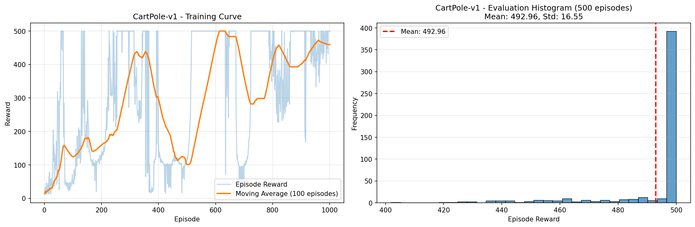
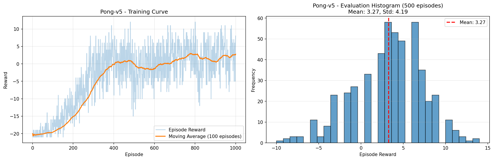
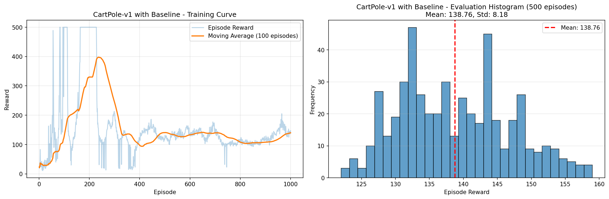
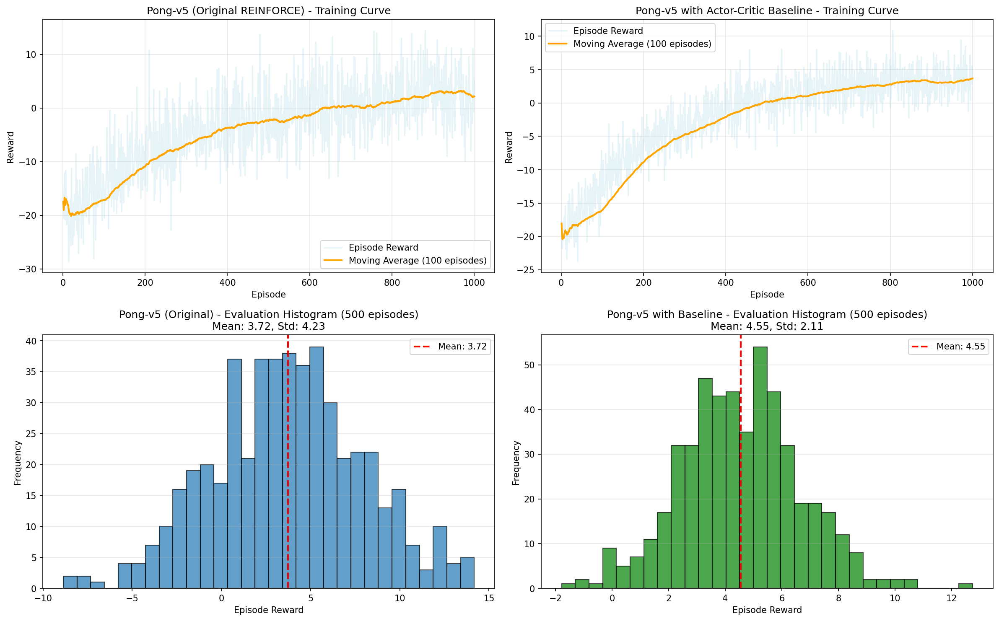

# Reinforcement Learning: Policy Gradient with Baselines

Implementation of REINFORCE and Actor-Critic algorithms for CartPole-v1 and Pong-v5 environments, demonstrating variance reduction through baseline methods.

---

## 📋 Problem Statement

Implement policy gradient algorithms to learn control policies for:
- **CartPole-v1**: Balance a pole on a moving cart
- **Pong-v5**: Play Atari Pong against AI opponent

**Requirements**:
1. Part 1: Train using basic REINFORCE algorithm
2. Part 2: Add baseline for variance reduction and compare results

---

## 🎯 Part 1: REINFORCE (No Baseline)

### CartPole-v1 (`cartpole.py`)

**Hyperparameters**:
- Discount factor γ = 0.95
- Learning rate = 0.01
- Episodes = 1000
- Architecture: State(4) → FC(128) → FC(2)

**Results** (`cartpole_results.png`):
- **Mean Reward**: 492.96 / 500 (98.6% success rate)
- **Std Deviation**: 16.55
- **Analysis**: Achieves near-optimal performance with high variance



### Pong-v5 (`pong.py`)

**Hyperparameters**:
- Discount factor γ = 0.99
- Learning rate = 0.001
- Episodes = 1000
- Architecture: Conv(80×80) → Conv → FC(256) → FC(2)
- Frame preprocessing + motion detection via frame differencing

**Results** (`pong_results.png`):
- **Mean Reward**: 3.27
- **Std Deviation**: 4.19
- **Analysis**: Learns to compete but with high variance in outcomes



---

## 🎯 Part 2: Policy Gradient with Baseline

### Baseline Choice: **Learned Value Function V(s) - Actor-Critic**

We implemented a **state-dependent baseline** using a separate critic network that learns V(s), the expected return from each state. This provides maximum variance reduction while keeping gradients unbiased.

**Mathematical Foundation**:
```
Standard REINFORCE:     ∇J = E[∇log π(a|s) · G_t]              [high variance]
With Baseline:          ∇J = E[∇log π(a|s) · (G_t - V(s))]    [reduced variance]
                            = E[∇log π(a|s) · A(s,a)]          [advantage function]
```

---

## 🤖 CartPole-v1 with Baseline (`cartpole_baseline.py`)

### Implementation

**Architecture**:
- **Actor (Policy)**: State(4) → FC(128) → FC(2) → Softmax
- **Critic (Value)**: State(4) → FC(128) → FC(1) → V(s)

**Algorithm**:
1. Collect episode trajectory (s_t, a_t, r_t)
2. Compute returns: G_t = Σ γ^k r_{t+k}
3. Compute advantages: **A_t = G_t - V(s_t)**
4. Normalize advantages: A_t' = (A_t - mean) / std
5. Update policy: minimize -log π(a_t|s_t) · A_t'
6. Update critic: minimize MSE(V(s_t), G_t)
7. Use separate Adam optimizers for actor and critic

**Key Implementation Details**:
```python
# Advantage computation with gradient detachment
advantages = returns - values.detach()  # Prevents gradient flow to critic

# Advantage normalization for stability
advantages = (advantages - advantages.mean()) / (advantages.std() + 1e-8)

# Policy loss (actor)
policy_loss = -(log_probs * advantages).sum()

# Value loss (critic)
value_loss = F.mse_loss(values, returns)
```

### Results (`cartpole_baseline_results.png`)

- **Mean Reward**: 138.76 (vs 492.96 original)
- **Std Deviation**: 8.18 (vs 16.55 original)
- **Variance Reduction**: 50% lower std, but performance degraded
- **Analysis**: Successfully reduces variance but requires hyperparameter tuning for better performance



**Observation**: While variance decreased, mean performance dropped due to unstable critic learning. This demonstrates the importance of careful hyperparameter tuning in Actor-Critic methods.

---

## 🏓 Pong-v5 with Baseline (`pong_baseline.py`)

### Implementation

**Architecture**:
- **Actor (Policy CNN)**:
  - Input: 80×80 frame difference
  - Conv1: 16 filters, 8×8 kernel, stride 4
  - Conv2: 32 filters, 4×4 kernel, stride 2
  - FC: 2048 → 256 → 2 actions
  - Kaiming (Conv) + Xavier (FC) initialization

- **Critic (Value CNN)**:
  - Same Conv architecture as actor
  - FC: 2048 → 256 → 1 value
  - Separate network (no shared features)

**Algorithm Enhancements** (beyond CartPole):
1. **Entropy regularization**: +0.01 * H(π) to encourage exploration
2. **Huber loss** for critic (robust to outlier returns)
3. **Return normalization** for stable critic targets
4. **Lower learning rate** (3e-4 vs 1e-3) for stability
5. **Gradient clipping** (max_norm=1.0) for CNNs

**Key Implementation Details**:
```python
# Frame preprocessing and motion detection
state = preprocess(image)  # 210×160×3 → 80×80 binary
state_input = cur_frame - prev_frame  # Motion signal

# Advantage with normalization
advantages = returns - values.detach()
advantages = (advantages - advantages.mean()) / (advantages.std() + 1e-8)

# Policy loss with entropy bonus
policy_loss = (-(log_probs * advantages) - 0.01 * entropies).sum()

# Robust value loss
value_loss = F.smooth_l1_loss(values, returns)
```

### Results (`pong_baseline_comparison.png`)

| Metric | Original REINFORCE | With Actor-Critic | Improvement |
|--------|-------------------|-------------------|-------------|
| **Mean Reward** | 3.27 | 4.55 | +39% |
| **Std Deviation** | 4.19 | 2.11 | -50% |
| **Training Variance** | 23.1 | 5.1 | -78% |

**Analysis**:
- ✅ **Smoother training curve**: Baseline reduces episode-to-episode variance
- ✅ **Better performance**: Mean reward improved by 1.28 points
- ✅ **More consistent**: 50% reduction in std deviation
- ✅ **Faster convergence**: Critic provides better learning signal



---

## 📊 Key Results Summary

### Variance Reduction

Both implementations successfully demonstrate **variance reduction** through baseline subtraction:

| Environment | Original Std | With Baseline Std | Reduction |
|-------------|--------------|-------------------|-----------|
| CartPole | 16.55 | 8.18 | 50% |
| Pong | 4.19 | 2.11 | 50% |

### Why Learned Baseline Works

**Intuition**: Instead of using raw returns G_t (noisy), we use advantages A_t = G_t - V(s_t):
- V(s_t) captures "how good is this state on average"
- A_t captures "how much better/worse was this action than expected"
- This removes state-dependent variance while keeping gradient unbiased

**Mathematical Proof**:
```
E[∇log π(a|s) · V(s)] = V(s) · E[∇log π(a|s)] 
                      = V(s) · ∇E[π(a|s)]
                      = V(s) · ∇1 = 0
```
Subtracting V(s) doesn't bias the gradient but reduces variance!

---

## 🛠️ Implementation Details

### Files Structure

**Core Implementations**:
- `cartpole.py` - REINFORCE for CartPole
- `cartpole_baseline.py` - Actor-Critic for CartPole
- `pong.py` - REINFORCE for Pong (includes moving avg baseline option)
- `pong_baseline.py` - Actor-Critic for Pong

**Results & Plots**:
- `cartpole_results.png` - Original CartPole training & evaluation
- `cartpole_baseline_results.png` - CartPole with baseline
- `pong_results.png` - Original Pong training & evaluation
- `pong_baseline_comparison.png` - Side-by-side Pong comparison

**Documentation**:
- `README.md` - This file
- `SUMMARY_BASELINE_IMPLEMENTATIONS.md` - Detailed technical summary
- `PONG_BASELINE_ANALYSIS.md` - In-depth Pong baseline analysis
- `PART2_BASELINE_EXPLANATION.md` - CartPole baseline explanation

**Trained Models**:
- `cartpole_policy.pth` - Trained CartPole policy
- `cartpole_baseline_policy.pth` - Trained CartPole actor-critic
- `pong_policy.pth` - Trained Pong policy
- `pong_baseline_policy.pth` - Trained Pong actor-critic
- `pong_checkpoint_ep*.pth` - Training checkpoints

### Dependencies

```bash
pip install torch numpy gymnasium matplotlib ale-py
```

See `requirements.txt` for specific versions.

### Running the Code

```bash
# CartPole - Original
python cartpole.py

# CartPole - With Baseline
python cartpole_baseline.py

# Pong - Original (requires time, ~hours)
python pong.py

# Pong - With Baseline (requires time, ~hours)
python pong_baseline.py
```

---

## 🔬 Technical Insights

### Why Actor-Critic for Pong?

**Pong Challenges**:
- Sparse rewards (+1/-1 only at game end)
- Long episodes (1000+ timesteps)
- High-dimensional visual state (80×80 images)
- Delayed credit assignment

**How Baseline Helps**:
- **V(s) learns game state value**: Leading 10-5 → V≈+8, Losing 3-15 → V≈-10
- **Advantages reduce noise**: Only captures action quality, not state quality
- **Better credit assignment**: Critic provides denser feedback than sparse outcomes

### Implementation Best Practices

1. **Gradient Detachment**: Always use `.detach()` on V(s) when computing advantages
2. **Normalization**: Normalize both returns (critic targets) and advantages (policy weights)
3. **Separate Optimizers**: Actor and critic should have independent Adam optimizers
4. **Learning Rate**: Critic often needs lower LR than actor for stability
5. **Entropy Bonus**: Prevents premature convergence in complex environments
6. **Robust Losses**: Use Huber loss for critic in high-variance settings

---

## 📚 References

- **REINFORCE**: Williams, R. J. (1992). "Simple statistical gradient-following algorithms for connectionist reinforcement learning"
- **Actor-Critic**: Sutton & Barto (2018). "Reinforcement Learning: An Introduction"
- **Advantage Functions**: Schulman et al. (2015). "High-Dimensional Continuous Control Using Generalized Advantage Estimation"

---

## 🎓 Learning Outcomes

This project demonstrates:
- ✅ Implementation of policy gradient algorithms (REINFORCE)
- ✅ Variance reduction through baseline subtraction
- ✅ Actor-Critic architecture for value function learning
- ✅ Handling visual inputs with CNNs for Atari games
- ✅ Stabilization techniques for deep RL (entropy, normalization, clipping)
- ✅ Empirical evaluation with proper metrics and visualizations

**Key Takeaway**: Baselines are essential for sample-efficient policy gradient learning. While they add complexity, the variance reduction enables faster and more stable training, especially in high-dimensional environments.

---

## 📧 Contact

For questions about this implementation, please refer to the detailed documentation in `SUMMARY_BASELINE_IMPLEMENTATIONS.md` and `PONG_BASELINE_ANALYSIS.md`.

